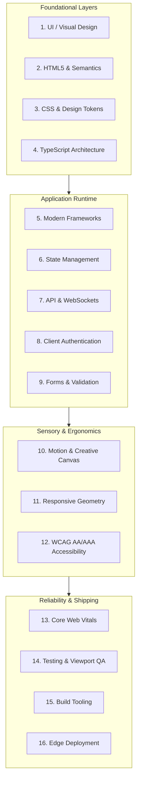

# Frontend Architecture Pillars

Pixasso orchestrates digital product craft through sixteen interconnected disciplines. Frontend development is not limited to styling visual surfaces: it bridges emotional art direction with reliable, performant client-side software architecture.

---

## 1. UI / Visual Design & Art Direction
- **Objective**: Establish distinctive aesthetic character, visual hierarchy, spatial tension, and emotional tone.
- **Key Concepts**:
  - Eliminating generic AI tropes: no default purple blobs, unmotivated glassmorphism, or Lucide icon flooding.
  - Intentional ground tones: Ivory Paper (`#fbfaf7`), Phosphor CRT (`#0a0f0d`), Pitch Black AMOLED (`#000000`).
  - Spatial discipline: 4px/8px baseline grid, asymmetric structural borders, and purposeful whitespace.
  - References: `https://stripe.dev/`, `https://rge-partner.de/`, `https://noerd.se/`, `https://curated.design/`.

---

## 2. HTML5 & Semantic JSX
- **Objective**: Structural integrity, machine readability, and native accessibility.
- **Standard**:
  - Always prefer native semantic elements: `<main>`, `<nav>`, `<article>`, `<aside>`, `<header>`, `<footer>`, `<figure>`, `<figcaption>`.
  - Buttons must be `<button type="button">` or `<button type="submit">`, never unstyled `
`.
  - Headings must follow strict mathematical sequence (`h1` -> `h2` -> `h3`) without skipping levels for visual styling.
  - Decorative SVG assets must declare `aria-hidden="true"` and `focusable="false"`.

---

## 3. Modern CSS, Design Tokens & Tailwind CSS
- **Objective**: Maintainable, theme-agnostic styling systems with predictable cascade and zero layout thrashing.
- **Architecture**:
  - Standardized CSS Custom Properties defined on `:root` and theme attributes (`data-theme="paper"`, `data-theme="crt"`, `data-theme="amoled"`).
  - Modern layout modes: CSS Grid with named template areas, subgrid, and Flexbox alignment.
  - Fluid typography and spacing via mathematical `clamp()` functions instead of brittle breakpoint jumps.
  - Clean Tailwind 3/4 tokens mapping semantic colors: `var(--bg-ground)`, `var(--text-primary)`, `var(--border-hairline)`.

---

## 4. JavaScript & TypeScript Logic
- **Objective**: Type-safe domain models, deterministic client logic, and robust runtime contracts.
- **Rules**:
  - Strict TypeScript mode (`noImplicitAny`, `strictNullChecks`).
  - Discriminated unions for asynchronous UI states (`idle | loading | success | error`).
  - Immutability patterns using pure utility transformations.
  - Defensive error handling with custom typed result objects instead of unhandled exceptions.

---

## 5. Modern Frameworks (React, Next.js, Svelte, Vue)
- **Objective**: Scalable component composition, hydration efficiency, and modern rendering patterns.
- **Standards**:
  - React 19 & Next.js App Router conventions: Server Components for static/data trees, Client Components (`'use client'`) strictly for interactivity.
  - Clean props interfaces with explicit typing.
  - Composition over deep prop-drilling: Slot patterns, compound components (`Dialog`, `Dialog.Trigger`, `Dialog.Content`).
  - Suspense boundaries with skeleton fallbacks matching exact content geometry.

---

## 6. State Management (Zustand, Redux, Context)
- **Objective**: Predictable, isolated, and inspectable application state without unnecessary re-renders.
- **Guidelines**:
  - Local state first: `useState` or `useReducer` for component-isolated states.
  - Global client state: Zustand for lightweight, boilerplate-free stores with selective subscriptions.
  - Server state caching: TanStack Query (React Query) or SWR for caching, deduping, background revalidation, and optimistic updates.
  - URL state synchronization: Store filter, search, and pagination parameters directly in search params (`nuqs` or Next.js `useSearchParams`).

---

## 7. API & WebSocket Integration
- **Objective**: Resilient data synchronization, real-time telemetry, and graceful offline handling.
- **Protocols**:
  - Type-safe HTTP clients with auto-retry, exponential backoff, and rate-limit handling.
  - WebSocket and SSE (Server-Sent Events) streaming with automatic reconnection loops and heartbeats.
  - Optimistic UI updates with rollback handlers for instant interaction feedback.

---

## 8. Client Authentication & Permissions UX
- **Objective**: Secure, frictionless login, session persistence, and role-based interface masking.
- **Requirements**:
  - Token handling: HTTP-only cookies preferred; bearer tokens stored strictly in memory when cookies are unavailable.
  - Route guards: Middleware authentication checks before route rendering.
  - Granular permission hooks: `usePermission('feature:write')` disabling or hiding forbidden action controls.
  - Seamless re-authentication dialogs without clearing user form state.

---

## 9. Forms & Zod Schema Validation
- **Objective**: Bulletproof user input collection with instant client-side feedback and shared server schemas.
- **Implementation**:
  - Controlled inputs via React Hook Form integrated with Zod resolvers.
  - Immediate visual feedback on field blur and accessible error banners linked via `aria-describedby`.
  - Masked and formatted input fields (phone, currency, credit cards, dates).
  - Draft autosaving to `localStorage` or session cache to prevent accidental data loss.

---

## 10. Motion, GSAP, Lenis & WebGL 3D
- **Objective**: Atmospheric brand feel, kinetic hierarchy, and high-performance interactive canvases.
- **Practices**:
  - Motion with purpose: 150ms to 300ms for micro-interactions; 400ms to 700ms for spatial transitions.
  - Physics-based springs using Motion (Framer Motion) or GSAP with cubic bezier curves.
  - Smooth inertial scrolling via Lenis when justified by editorial or portfolio art direction.
  - Interactive Canvas / WebGL: Three.js or Canvas 2D math art (wave oscillators, dials, interactive particle fields) running strictly within `requestAnimationFrame` with passive event listeners.

---

## 11. Responsive Multi-Device Engineering
- **Objective**: Flawless visual cadence across Mobile (390px), Tablet (768px to 1024px), and Desktop (1440px+).
- **Checks**:
  - Zero horizontal document overflow (`scrollWidth === innerWidth`).
  - Touch target compliance: Minimum 44px by 44px clickable areas on mobile viewports.
  - Safe area insets: `env(safe-area-inset-top)` and `env(safe-area-inset-bottom)` for modern mobile devices.
  - CSS Container Queries (`@container`) for modular component-level responsiveness.

---

## 12. WCAG AA/AAA Accessibility
- **Objective**: Universal usability for all humans, assistive technologies, and keyboard navigators.
- **Checklist**:
  - Color contrast: Minimum 4.5:1 for body copy; 3:1 for large display titles and interactive borders.
  - Visible focus indicators: 2px offset focus rings on `:focus-visible`, never suppressed.
  - Complete keyboard traversal: Logical tab sequence, trap focus inside open modals, ESC to dismiss.
  - Screen reader announcements: `aria-live="polite"` for dynamic updates, meaningful `alt` text for images.
  - Reduced motion support: Strict adherence to `@media (prefers-reduced-motion: reduce)`.

---

## 13. Core Web Vitals & Performance Optimization
- **Objective**: Instant perception of speed and silky 60fps rendering.
- **Metrics & Targets**:
  - Largest Contentful Paint (LCP): Under 1.8 seconds.
  - Cumulative Layout Shift (CLS): Under 0.05 (explicit image dimensions, font display swap/optional).
  - Interaction to Next Paint (INP): Under 100 milliseconds.
  - Font optimization: Self-hosted WOFF2 with modern unicode ranges and `size-adjust` metrics.

---

## 14. Comprehensive Testing & Multi-Viewport QA
- **Objective**: Deterministic regression prevention across visual, functional, and sensory layers.
- **Tooling**:
  - Unit & Integration: Vitest and React Testing Library for component state transitions and user events.
  - End-to-End: Playwright for critical user journeys and form submission verification.
  - Automated Viewport Sweeps: Browser automation testing at 390px, 768px, 1024px, and 1440px.
  - Sonic verification: UISFX audio cue validation ensuring subtle, non-intrusive sound micro-interactions.

---

## 15. Development & Production Tooling
- **Objective**: Rapid developer feedback loops, automated formatting, and strict linting guards.
- **Toolchain**:
  - Vite or Next.js Turbopack for sub-second hot module replacement.
  - ESLint with typescript-eslint, jsx-a11y, and react-hooks plugins.
  - Biome or Prettier for consistent human-written code formatting.
  - TypeScript project references for mono-repo builds.

---

## 16. Production Deployment & Edge Delivery
- **Objective**: Immutable release pipelines, global edge distribution, and instantaneous rollbacks.
- **Platforms**:
  - Vercel, Cloudflare Pages, Netlify, or GitHub Pages.
  - Custom domain binding with automated SSL certification (`CNAME`).
  - Automated CI/CD workflows executing lint, typecheck, test, and preview deployments on every push.
