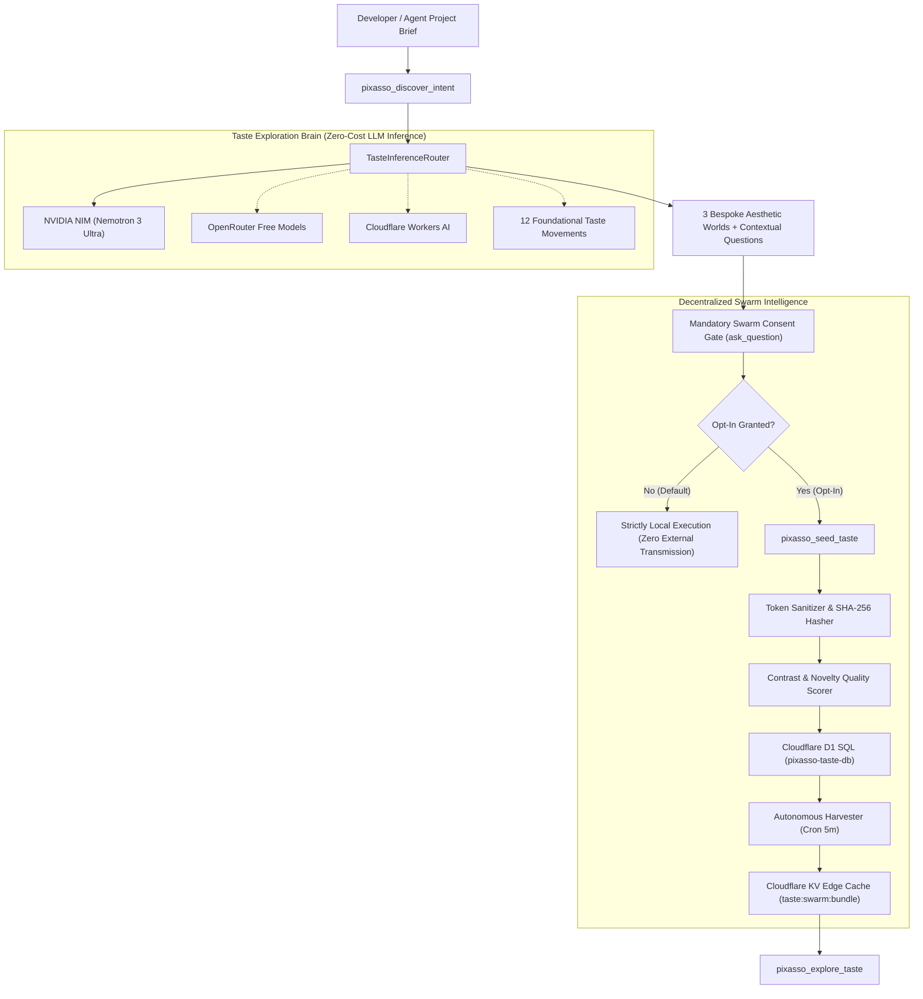

# Design Taste Engine & Decentralized Swarm Intelligence

Pixasso includes an autonomous Self-Learning Taste Engine and federated Swarm Intelligence layer. It solves two common pitfalls in AI-assisted frontend development: repetitive, generic intent-discovery questions and standard AI design tropes (such as purple gradients, Lucide icon flooding, and generic Inter typography).

Related: [discovery-framework.md](discovery-framework.md), [tool-registry.md](tool-registry.md), [design-genome.md](design-genome.md)

---

## 1. System Architecture

---

## 2. Zero-Cost Multi-Provider Inference Router

Pixasso guarantees that end users incur zero financial cost for creative exploration. The engine routes prompts through a prioritized hierarchy of free LLM tiers with 24-hour SHA-256 result caching:

1. **NVIDIA NIM (Nemotron 3 Ultra 550B)**: Flagship high-capacity reasoning model with zero user cost via developer tier.
2. **OpenRouter Free Tier**: Automatic fallback to zero-credit models (such as `meta-llama/llama-3.3-70b-instruct:free`).
3. **Cloudflare Workers AI**: Edge-native inference (`@cf/meta/llama-3.1-8b-instruct`) for serverless worker deployments.
4. **Deterministic Foundational Graph**: 12 pre-seeded high-craft design movements available completely offline with zero network connectivity.

Each synthesis yields exactly 3 radically distinct aesthetic worlds tailored to the brief, complete with:
- Display, body, and accent typography pairings
- Ground tone and surface materiality descriptions
- Layout geometry (asymmetric bento, 12-column rigid grid, spatial canvas)
- Motion physics signatures and easing curves
- Subtle Web Audio API (UISFX) micro-interaction cues
- Curated color palettes

---

## 3. The 12 Foundational Taste Movements

When operating offline or in air-gapped environments, Pixasso draws from 12 canonical design movements:

| ID | Movement Name | Ground Tone | Typographic Pairing | Key Vibe |
| :--- | :--- | :--- | :--- | :--- |
| `swiss-international` | Swiss International Typographic | `#ffffff` stark white | Syne + Inter + Space Mono | Mathematical grid discipline, hairlines, zero shadows |
| `warm-editorial` | Warm Literary Parchment | `#fbfaf7` ivory paper | Newsreader + Newsreader + JetBrains Mono | Literary poise, wide margins, figure captions |
| `obsidian-precision` | Obsidian Precision | `#0a0f12` slate | Space Grotesk + JetBrains Mono | High-contrast technical restraint, razor-sharp 1px borders |
| `crt-phosphor` | CRT Phosphor Terminal | `#0a0f0d` cathode dark | JetBrains Mono + Space Mono | Emerald `#33ff66` phosphor glow, scanline overlays |
| `amoled-black` | Pitch Black AMOLED | `#000000` pitch black | Syne + Inter + JetBrains Mono | True black, cobalt blue `#0055ff` highlights, crisp panels |
| `solarpunk-organic` | Solarpunk Biophilic | `#0b1a13` deep forest | Fraunces + Plus Jakarta Sans | Organic sage `#4ade80`, solar amber, living geometry |
| `tactile-brutalism` | Concrete Brutalism | `#e5e5e0` raw concrete | Space Grotesk + Archivo Black | Monolithic slabs, thick `#000000` hairlines, raw typography |
| `japanese-mono` | Neo-Tokyo Minimalist | `#f7f7f5` warm wabi-sabi | Zen Kaku Gothic + Noto Sans Mono | Asymmetric emptiness (ma), crimson `#dc2626` seals |
| `spatial-glass` | Spatial Refraction | `#030712` midnight void | Plus Jakarta Sans + Inter | Glass refraction, frosted blur, ethereal specular highlights |
| `kinetic-acid` | Acid Kinetic Studio | `#0d0d0d` ink dark | Syne 800 + Space Grotesk | High-velocity kinetic tension, electric acid lime `#ccff00` |
| `luxury-editorial` | Haute Horlogerie & Monograph | `#0f1115` basalt | Cormorant Garamond + Inter | Basalt stone, Champagne gold `#d4af37`, hairline dividers |
| `generative-math` | Computational Generative Art | `#0e1117` algorithmic slate | JetBrains Mono + Inter | Fourier wave paths, coordinate matrix, parameter telemetry |

---

## 4. Federated Taste Swarm & Privacy Boundaries

Modeled after peer-to-peer distribution, client nodes (developers and coding agents) can anonymously seed validated design tokens back to a central living Taste Graph.

### Strict Opt-In Consent Protocol
- Swarm seeding is strictly disabled by default (`swarmOptIn: false`).
- During intent discovery (`pixasso_discover_intent`), users are presented with an interactive choice:
  1. `(Recommended) Keep strictly private`: All processing occurs locally with zero external transmission.
  2. `Opt in to Taste Swarm`: Anonymously seed sanitized design tokens to evolve the global design brain.
- Preferences can be managed locally in `.pixassorc.json` or via `PIXASSO_SWARM_OPT_IN` environment variables.

### Rigorous Token Sanitization
Seeds contain non-proprietary visual design parameters only:
- Font family names (display, body, accent) and modular scale ratios
- Color palette hex values (primary, secondary, surface, accent, muted, border)
- Layout structure metadata (geometry type, grid columns, bento layout flag)
- Motion curves (physics description, duration, cubic-bezier easing)
- Audio cues (oscillator frequency, wave type, gain)

Excluded from transmission:
- Proprietary source code and file paths
- Project names, user text, and credentials
- Personal identifiers and IP addresses (user IDs are salted and hashed via SHA-256)

---

## 5. Storage & Quality Evaluation

### Cloudflare D1 Relational Engine (`pixasso-taste-db`)
The central coordinator runs on serverless Cloudflare D1 SQL across three optimized tables:
- `taste_seeds`: Stores normalized tokens with SHA-256 seed hashes, quality scores, novelty scores, and upvotes.
- `taste_nodes`: Curated movement registry synchronized with edge nodes.
- `user_consents`: Salted SHA-256 user hashes with explicit consent statuses.

### Automated Quality Scoring
Every submitted seed is evaluated through algorithmic heuristics:
1. **Contrast Ratio (WCAG)**: Evaluates luminance contrast between primary foreground and surface background (penalizes ratios under 4.5:1, rewards ratios exceeding 7.0:1).
2. **Anti-Trope Novelty**: Penalizes common AI tropes (such as generic Inter-only pairings with `#6366f1` purple) and rewards expressive typography and intentional layout geometry.
3. **Deduplication**: Identical token configurations increment seed upvotes rather than duplicating entries.

### Autonomous Harvester Cron
A Cloudflare Worker cron trigger runs every 5 minutes to synchronize foundational movements, calculate top-rated seeds, and edge-cache a compiled swarm bundle (`taste:swarm:bundle`) in Cloudflare KV for sub-millisecond retrieval.
