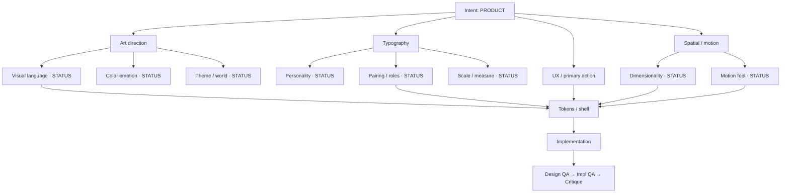
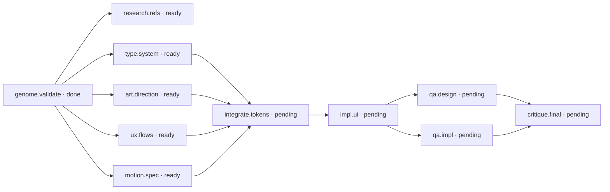

# Design Brain

User-visible map of this project's Design Genome, decisions, and Task DAG.
Machine truth: `design-genome.yaml`, `task-graph.yaml`, `typography-spec.yaml` (paths may vary).
This file is a **reference to inspect**, not a form to fill during conversation.

| Meta | Value |
| :--- | :--- |
| Project | |
| Updated | |
| Genome status | draft / validated / locked / revising |
| Phase | discovery / genome_validation / research / planning / execution / qa / complete |

---

## Legend

| Marker | Meaning |
| :--- | :--- |
| known | User stated or confirmed |
| inferred | Safe agent inference; confirm if material |
| uncertain | Needs a decision before costly work |
| unavailable | Not inventable yet (for example fonts) |
| pending / ready / running / done / blocked / stale | Task DAG status |

---

## 1. Intent snapshot

- **Build**: 
- **Primary action**: 
- **Audience**: 
- **Emotional outcome**: 
- **Epistemic**: known / inferred / mixed

---

## 2. Decision tree (Mermaid)

Replace placeholders with project-specific labels. Mark known vs inferred on critical nodes.

---

## 3. Task DAG (Mermaid)

Rewire nodes to match `task-graph.yaml`. Drop unused roles (for example spatial.3d) when not needed.

---

## 4. Node legend (prose)

| ID | What it means | Status | Known / inferred | Notes |
| :--- | :--- | :--- | :--- | :--- |
| genome.validate | Human confirms genome | | | |
| type.system | Typography spec lock | | | |
| art.direction | Visual language + color roles | | | |
| ux.flows | IA and primary flows | | | |
| motion.spec | Motion + reduced-motion | | | |
| integrate.tokens | Shared tokens / shell | | | |
| impl.ui | Production UI | | | |
| qa.design | Craft / anti-pattern audit | | | |
| qa.impl | Browser, responsive, a11y, security | | | |
| critique.final | Five-pillar critique | | | |

Add or remove rows to match the live DAG.

---

## 5. Open conflicts and blockers

- 

---

## 6. Next visible moves

1. 
2. 

---

## Refresh checklist

- [ ] Matches current `design-genome.yaml`
- [ ] Matches current `task-graph.yaml`
- [ ] Epistemic markers honest on intent, type, and dimensionality
- [ ] Surfaced to user at validation / material update / pre-implementation
