# Pixasso

> **The Complete End-to-End Frontend Engineering & Design Orchestrator for AI Agents and Humans.**

[](LICENSE)
[](https://www.npmjs.com/package/pixasso-mcp)
[](https://www.npmjs.com/package/pixasso-mcp)
[](mcp-server/)
[](mcp-server/src/)
[](scripts/install.js)
[](https://m8ven.ai/mcp/erebuzzz-pixasso-gijvqs)
[](https://pixasso.erebuzzz.tech)

Live Documentation and Showcase: **[pixasso.erebuzzz.tech](https://pixasso.erebuzzz.tech)**

---

## Overview

Pixasso is a senior design-research, intent-discovery, and full-spectrum frontend engineering orchestrator inspired by Picasso's exploratory breadth. It rejects cookie-cutter AI interfaces, purple gradients, Lucide icon flooding, and superficial templates. Instead, Pixasso guides autonomous coding agents (and human engineers) through a rigorous pipeline:

```text
Intent Discovery -> Design Genome -> Decision Graph -> Capability Graph -> Task DAG -> Specialist Agents -> Automated QA
```

Pixasso unifies **Art Direction**, **UX Architecture**, **Typography Direction**, **Motion Systems**, **Full-Stack Frontend Implementation**, and **Automated Multi-Viewport Testing** into a single cohesive skill and Model Context Protocol (MCP) server.

---

## Visual Showcase & Themes

Pixasso supports multi-mode aesthetic execution tailored to your product identity:

| Theme | Aesthetic Mode | Key Visual Traits |
| :--- | :--- | :--- |
| **Paper Light** | Architectural Editorial | Warm ivory (`#fbfaf7`), hairlines, wide grotesque display headlines, Newsreader serif body |
| **CRT Terminal** | Retro Phosphor Computing | Phosphor emerald (`#00ff66`), scanlines, cathode vignette, bracket hotkeys `[B]`, monospace telemetry |
| **Pitch Black AMOLED** | Deep Space Operations | True `#000000` ground, cold metallic accents, sharp geometric borders, maximum contrast |

### Interface Previews

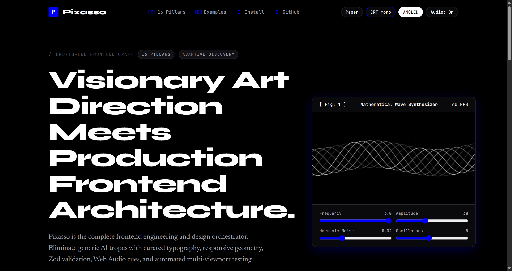
*Figure 1: Architectural Paper Light Theme with wide display headlines and generative wave synthesizer.*

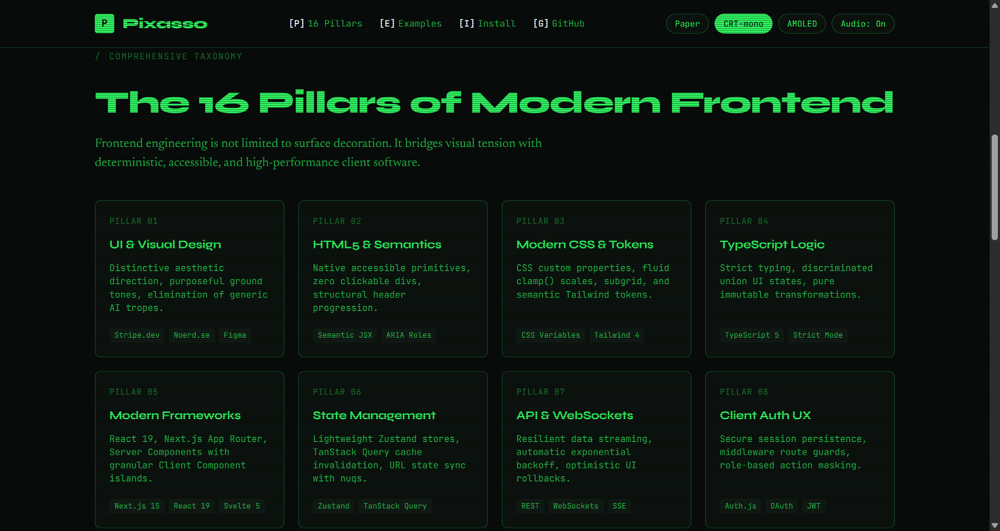
*Figure 2: Retro Cathode Ray Terminal Theme with phosphor glow, scanline shader, and telemetry HUD.*

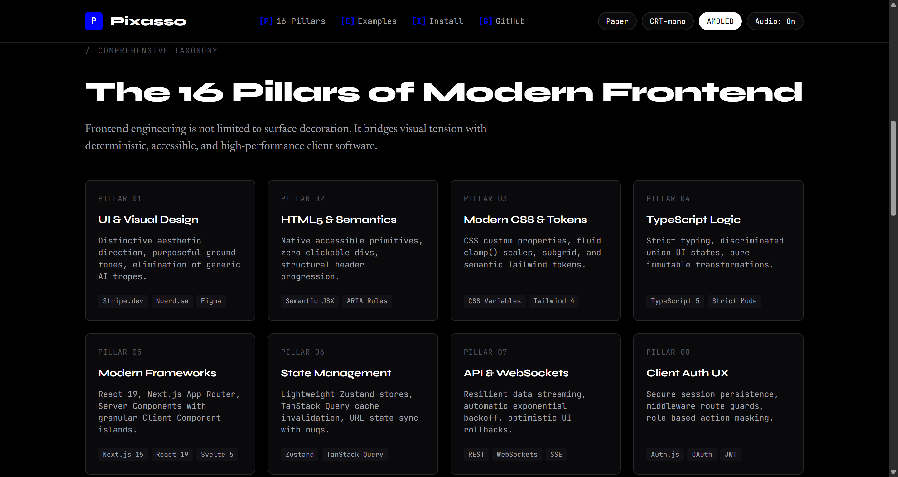
*Figure 3: Pitch Black AMOLED Theme optimized for high-contrast, edge-density operational dashboards.*

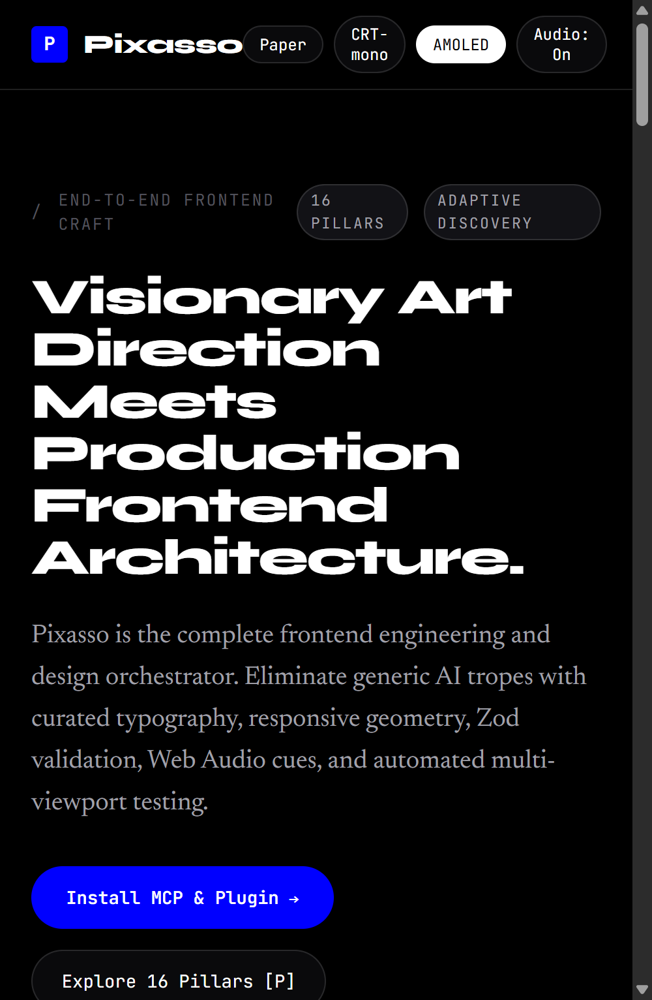
*Figure 4: Mobile Viewport (390px) verified with zero horizontal DOM overflow and accessible touch targets.*

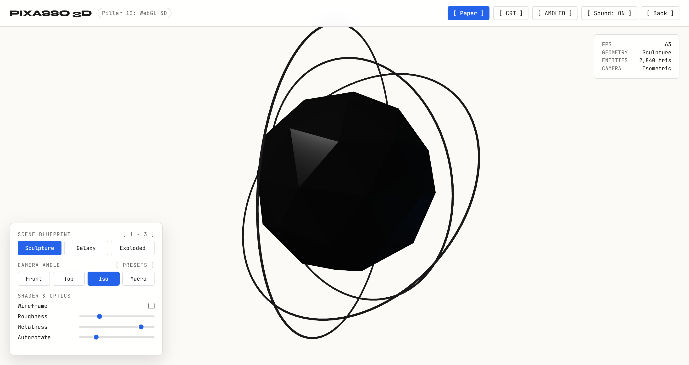
*Figure 5: 3D Kinetic Sculpture with procedural faceted cage, PBR metallic core, and orbital gimbal rings.*

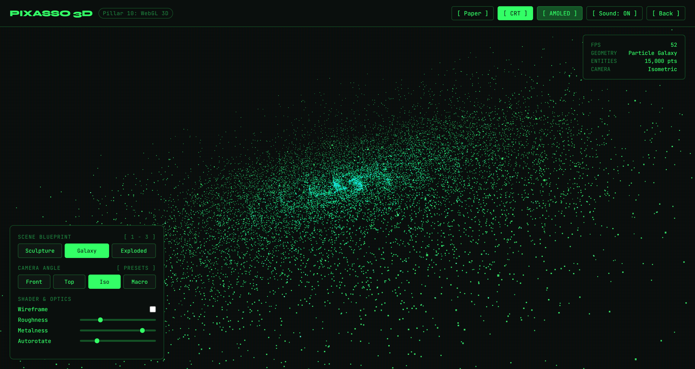
*Figure 6: 15,000 GPU particle galaxy in CRT phosphor mode with mouse gravitational attraction vectors.*

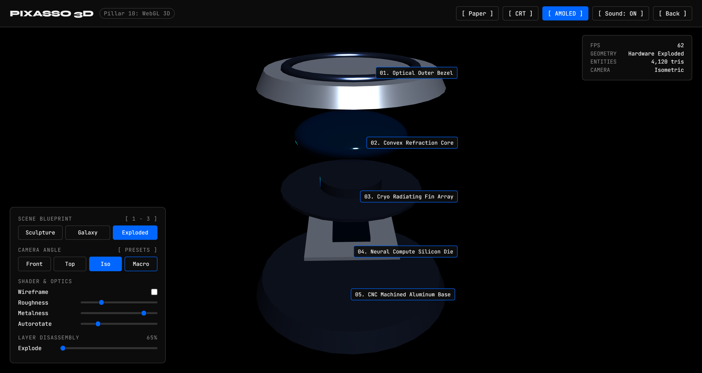
*Figure 7: 5-Layer precision hardware assembly with interactive exploded-view disassembly slider and callouts.*

---

## The 16 Pillars of Frontend Architecture

Pixasso treats frontend engineering not as shallow visual styling, but as a complete 16-pillar software engineering discipline:

| Pillar | Discipline | Key Technical Responsibilities |
| :--- | :--- | :--- |
| **1. UI & Visual Design** | Design Systems & Tokens | Semantic color scales, modular typography scales, surface depth, spacing systems |
| **2. Semantic HTML & JSX** | Document Structure | Accessible landmarks (`main`, `nav`, `article`), ARIA roles, microdata, zero `div` soup |
| **3. Modern CSS Systems** | Styling Architecture | CSS custom properties, container queries, Cascade Layers (`@layer`), subgrid, zero-runtime CSS |
| **4. TypeScript Excellence** | Type Safety | Strict mode, discriminated unions for UI state, zero `any`, typed event handlers |
| **5. Framework Architecture** | Component Lifecycle | React 19, Next.js App Router, Svelte 5 runes, Vue 3 Composition, Islands Architecture |
| **6. State Management** | Data Flow & Cache | Server state (TanStack Query), client state (Zustand), URL search params as source of truth |
| **7. API & Realtime Data** | Network Transport | Type-safe REST, GraphQL, WebSockets, Server-Sent Events, optimistic UI mutations |
| **8. Client Authentication UX** | Session Security | Route protection guards, PKCE OAuth flows, token refresh queues, zero credential flicker |
| **9. Forms & Input Validation** | Data Integrity | React Hook Form, Zod schema validation, inline error hints, accessible fieldsets |
| **10. Motion & Animation** | Kinetic Direction | Motion (motion.dev), GSAP timelines, WebGL canvas shaders, `prefers-reduced-motion` |
| **11. Responsive Design** | Viewport Versatility | Fluid typography (`clamp()`), container queries, adaptive layouts (390px to 2560px+) |
| **12. Accessibility (WCAG)** | Inclusive Design | WCAG 2.2 AA/AAA compliance, screen reader tree, keyboard traps, focus rings, ARIA live |
| **13. Core Web Vitals** | Performance Budget | LCP under 1.2s, INP under 100ms, CLS at 0, streaming SSR, image srcset optimization |
| **14. Frontend Testing** | Verification Suite | Vitest component unit tests, Playwright end-to-end tests, visual regression checks |
| **15. Tooling & Bundling** | Developer Experience | Vite, Turbopack, Biome/ESLint linting, automated dependency updates, Docker images |
| **16. Deployment & CDN** | Production Release | Edge runtime, CDN cache headers (`stale-while-revalidate`), atomic rollbacks, CI/CD |

---

## System Architecture

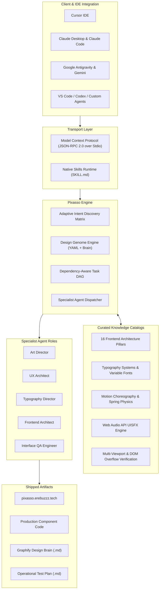

---

## Operating Principle: Intent to Validation

Pixasso enforces a structured workflow that turns user intent into verified production code:

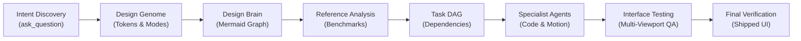

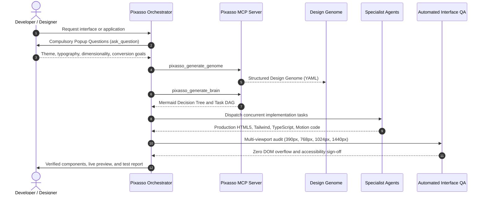

---

## Compulsory Popup Discovery Gate

Pixasso strictly forbids assuming generic defaults or hiding questions inside plans. Before generating code or planning architectures, agents must call `ask_question` across key dimensions:

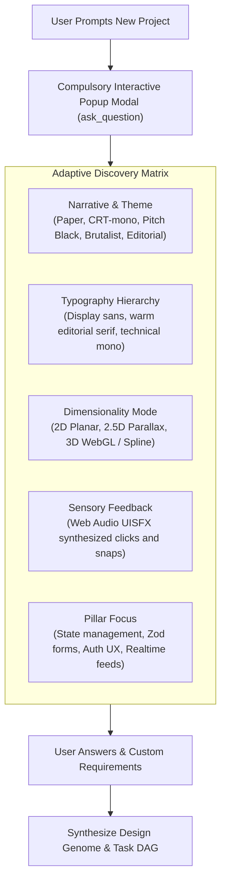

---

## Installation & Setup

Pixasso works across all major AI development environments.

### 1. Unified Automatic Installer (Recommended)

Run the automated installer script from the root of the repository. It detects your installed platforms and configures them automatically:

```bash
# Clone the repository
git clone https://github.com/Erebuzzz/pixasso.git
cd pixasso

# Install dependencies and build MCP server
npm install
npm run build

# Run automated multi-platform installer
node scripts/install.js
```

The installer automatically configures:
- **Google Antigravity**: Plugin package (`plugins/pixasso`) and active MCP configuration.
- **Cursor IDE**: Global configuration (`~/.cursor/mcp.json`) and local project configuration (`.cursor/mcp.json`).
- **Claude Desktop**: Native MCP server configuration (`claude_desktop_config.json`).
- **Claude Code**: CLI tool configuration (`claude mcp add`).

---

### 2. Connection Transports

Pixasso MCP supports both local stdio execution and hosted remote streaming:

#### Option A: Hosted Remote Endpoint (Zero Local Runtime)
Connect any remote-compatible MCP client directly to:
```text
https://mcp.pixasso.erebuzzz.tech/mcp
```
Secured with GitHub OAuth and a 200 call/day allowance per user. Ideal for environments where running local Node background processes is inconvenient.

#### Option B: Published npm Package (Local Stdio)
You can run Pixasso locally on any machine with Node.js installed using `npx -y pixasso-mcp`.

##### Cursor IDE
Add to `~/.cursor/mcp.json` or `.cursor/mcp.json`:

```json
{
  "mcpServers": {
    "pixasso": {
      "command": "npx",
      "args": ["-y", "pixasso-mcp"]
    }
  }
}
```
Or install via skills.sh:
```bash
npx skills add Erebuzzz/pixasso
```

##### Claude Desktop
Add to `%APPDATA%\Claude\claude_desktop_config.json` (Windows) or `~/Library/Application Support/Claude/claude_desktop_config.json` (macOS):

```json
{
  "mcpServers": {
    "pixasso": {
      "command": "npx",
      "args": ["-y", "pixasso-mcp"]
    }
  }
}
```

##### Claude Code CLI
```bash
claude mcp add pixasso npx -y pixasso-mcp
```
Or register the marketplace plugin:
```bash
/plugin marketplace add Erebuzzz/pixasso
```

##### Google Antigravity & Gemini CLI
Add to `~/.gemini/antigravity/mcp_config.json` or `~/.gemini/config/mcp_config.json`:

```json
{
  "mcpServers": {
    "pixasso": {
      "command": "npx",
      "args": ["-y", "pixasso-mcp"]
    }
  }
}
```
Or install the skill bundle:
```bash
npx skills add Erebuzzz/pixasso
```

##### Local Repository Clone (Developers)
If running against your local clone instead of npm, replace `"command": "npx"` and `"args": ["-y", "pixasso-mcp"]` with:
```json
{
  "mcpServers": {
    "pixasso": {
      "command": "node",
      "args": ["/path/to/pixasso/mcp-server/build/index.js"]
    }
  }
}
```
Tip: running `node scripts/install.js` configures your local clone path automatically across all installed editors.

#### ChatGPT / OpenAI Custom GPTs / Web UIs
For web-based LLMs, import the standalone system prompts located in:
- `skills/pixasso/prompts/pixasso-system-prompt.md`
- `skills/pixasso/prompts/discovery-interview-prompt.md`
- `skills/pixasso/prompts/design-critique-prompt.md`

---

## MCP Server Capabilities

The Pixasso MCP Server (`mcp-server/`) exposes the full design intelligence engine via standard JSON-RPC 2.0:

### Tools

| Tool Name | Purpose | Parameters |
| :--- | :--- | :--- |
| `pixasso_discover_intent` | Generates adaptive discovery questions based on archetype | `archetype`, `user_input`, `referenceUrls` |
| `pixasso_search_references` | Queries the 31 curated catalogs (20 references, 11 templates) for UI, motion, and design patterns | `query`, `category`, `limit` |
| `pixasso_fetch_reference` | Fetches and analyzes live URLs via streaming HTML and Readability, extracting headings, copy, and detecting client-rendered SPA shells | `url` |
| `pixasso_generate_genome` | Compiles design choices into a validated `design-genome.yaml` with hard-gate reference verification | `projectName`, `themeMode`, `groundTone`, `typography`, `colorTokens`, `references` |
| `pixasso_generate_brain` | Generates a Graphify-style Mermaid decision map and Task DAG | `genomeYaml`, `projectName` |
| `pixasso_audit_design` | Audits code against generic AI anti-patterns and the 16 pillars | `code`, `componentType`, `framework` |
| `pixasso_generate_test_plan` | Produces an operational multi-viewport interface test plan | `componentName`, `targetViewports`, `interactiveBehaviors` |

### Resources

Access 31 curated knowledge resources directly through `pixasso://` URIs (20 references and 11 templates):
- `pixasso://references/frontend-architecture-pillars`
- `pixasso://references/typography-system`
- `pixasso://references/sound-and-sensory-design`
- `pixasso://references/interface-testing-and-qa`
- `pixasso://references/anti-patterns-and-critique`
- `pixasso://templates/design-genome`
- `pixasso://templates/task-graph`
- `pixasso://templates/interface-test-plan`

### Prompts

- `intent-discovery`: Guides the user through adaptive requirement extraction.
- `frontend-architecture`: Formulates component architecture across the 16 pillars.
- `design-critique`: Provides objective design reviews rejecting AI clichés.
- `typography-direction`: Generates hierarchical typography specifications.
- `interface-qa`: Generates multi-device QA scripts and DOM assertions.

---

## Showcase Examples

Explore standalone, fully-functional examples in `examples/`:

- **[Edge Operations Dashboard](examples/production-app/index.html)**: Live reactive metrics dashboard with Zod form validation, theme switcher, telemetry feed, and WCAG AA accessibility.
- **[Paper Editorial Layout](examples/paper-editorial/index.html)**: Archival publication layout featuring wide grotesque headlines, Newsreader serif body, hairlines, and figure plates.
- **[CRT Phosphor Terminal](examples/crt-terminal/index.html)**: Retro computing interface with scanlines, cathode vignette, bracket hotkeys, and simulated serial telemetry.
- **[Harmonic Wave Synthesizer](examples/generative-wave/index.html)**: Interactive mathematical wave canvas running in `requestAnimationFrame` with live audio oscillators.
- **[3D Spatial Visualization Suite](examples/3d-suite/index.html)**: Interactive Three.js studio inspired by `viettranx/3dviz-pro-max`, featuring kinetic geometric sculptures, 15k GPU particle galaxy, and 5-layer exploded hardware assembly with camera presets and real-time shader controls.

---

## 3D Spatial Computing & WebGL Architecture (viettranx/3dviz-pro-max Inspiration)

Pixasso integrates proven 3D recipes inspired by `viettranx/3dviz-pro-max` directly into Pillar 10 (Motion & WebGL 3D):

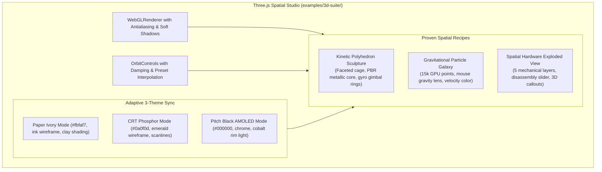

---

## Deployment Architecture

Pixasso's showcase site (`pixasso.erebuzzz.tech`).
### Primary: GitHub Pages via GitHub Actions
- **Pipeline**: Automated build and push via `.github/workflows/deploy-site.yml`.
- **Domain**: Root `CNAME` file mapped to `pixasso.erebuzzz.tech`.
- **Hosting & Edge**: Fastly and GitHub global edge CDN with automatic Let's Encrypt SSL certificates.

### Alternative: 1-Click Vercel Deployment
The repository includes a production-grade `vercel.json` configuration. You can optionally import `Erebuzzz/pixasso` into Vercel with zero build configuration:
- Instant worldwide edge caching.
- Clean routing for root site, examples, and screenshot assets.
- Automatic preview deployments for pull requests.

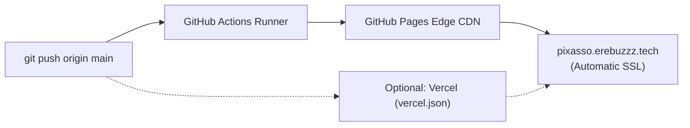

---

## Repository Structure

```text
pixasso/
├── CNAME                              # Custom domain: pixasso.erebuzzz.tech
├── package.json                       # Root scripts and workspace config
├── README.md                          # Full-spectrum documentation and architecture
├── AGENTS.md / CLAUDE.md / GEMINI.md  # Multi-agent rules and behavioral guardrails
├── .cursorrules                       # Cursor IDE rules
├── .cursor/                           # Cursor project configs, rules, and skills
├── .github/workflows/deploy-site.yml  # Automated GitHub Pages CI/CD pipeline
├── assets/screenshots/                # Multi-viewport screenshots and visual proofs
├── examples/                          # Standalone craft demonstrations
│   ├── production-app/                # Edge Operations reactive dashboard
│   ├── paper-editorial/               # Archival editorial publication
│   ├── crt-terminal/                  # Phosphor CRT retro terminal
│   └── generative-wave/               # Mathematical wave synthesizer canvas
├── mcp-server/                        # Standalone TypeScript MCP Server
│   ├── package.json
│   ├── tsconfig.json
│   └── src/index.ts                   # JSON-RPC 2.0 tools, resources, and prompts
├── plugins/pixasso/                   # Antigravity plugin distribution
├── scripts/                           # Tooling, installer, and test suites
│   ├── install.js                     # Unified multi-platform installer
│   ├── test-mcp.js                    # Automated MCP JSON-RPC protocol test suite
│   └── serve.js                       # Local HTTP preview server
├── site/                              # Showcase site (pixasso.erebuzzz.tech)
│   ├── index.html                     # Live website with theme engine and audio
│   └── assets/                        # Web assets and mirrored screenshots
├── skills/pixasso/                    # CANONICAL installable agent skill
│   ├── SKILL.md                       # Main skill definition
│   ├── references/                    # 20 curated design-research catalogs
│   ├── templates/                     # Operational templates (Genome, DAG, QA)
│   └── prompts/                       # Modular agent prompts
└── references/                        # Editable root reference catalogs
```

---

## Automated Interface Testing & QA

Pixasso treats testing as a core design deliverable:

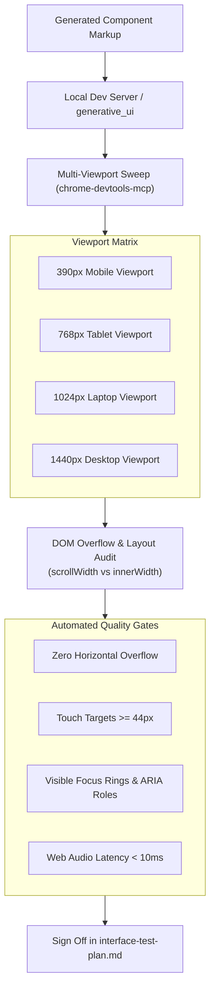

---

## Anti-Pattern Stance

Pixasso actively guards against generic AI aesthetics:

- **No Purple Gradients**: Replaced with intentional monochrome palettes, warm paper tones, or phosphor glow.
- **No Lucide Flooding**: Every icon must serve a precise informational function.
- **No Blanket Glassmorphism**: High-contrast borders, solid surface tokens, and crisp architectural lines replace muddy blurred cards.
- **No Decorative-Only Motion**: Animations must be communicative, respect `prefers-reduced-motion`, and run under 300ms.

---

## License & Privacy

- **License**: MIT. See [LICENSE](LICENSE).
- **Privacy Policy**: Zero telemetry, zero prompt recording, ephemeral in-memory processing. See [PRIVACY.md](PRIVACY.md).
- **Contributing**: See [CONTRIBUTING.md](CONTRIBUTING.md).
- **Security**: See [SECURITY.md](SECURITY.md).

