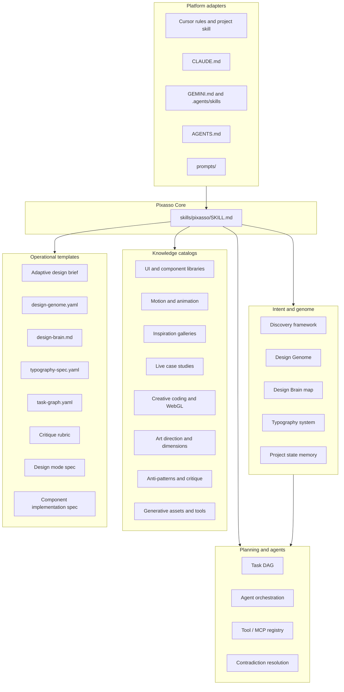
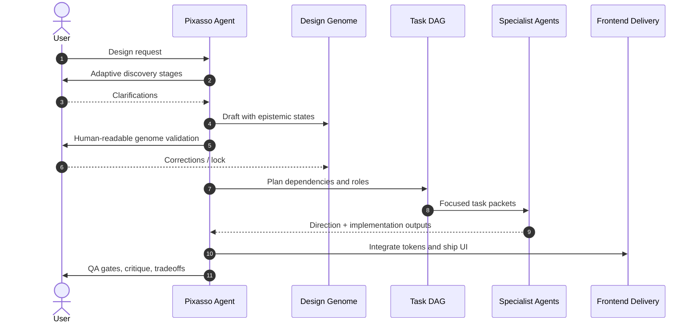
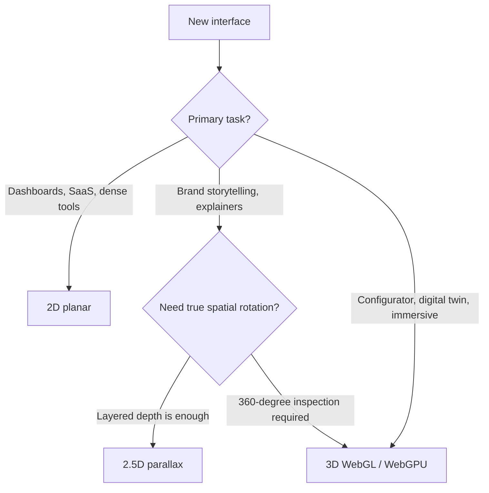

# Pixasso

Pixasso is a public **Agent Skill** for multidisciplinary design research, intent discovery, planning, and implementation. It helps agents (and humans) discover design intent, lock a Design Genome, orchestrate specialist work via a Task DAG, then critique and ship digital experiences with intentional art direction instead of generic AI UI defaults.

Inspired by Picasso's exploratory breadth, Pixasso synthesizes:
- **Art Director**: Visual language, composition, surface, emotional tone
- **UX Architect**: Hierarchy, flows, accessibility, cognitive load
- **UI Designer**: Components, responsive layout, typographic systems
- **Typography Director**: First-class type systems before layout lock
- **Motion Designer**: Communicative animation, scroll, springs, scene transitions
- **Design Researcher**: Benchmark deconstruction and principle extraction
- **Creative Technologist**: WebGL, WebGPU, canvas, shaders, generative assets
- **Frontend Architect**: Semantic, WCAG AA, production-ready web code
- **Orchestrator**: Genome-backed task graphs and capability-aware agent assignment

## When to use it

Use Pixasso when you need help with:
- Landing pages, marketing sites, portfolios, and editorial layouts
- Product UI, dashboards, design systems, and component specs
- Motion systems, scroll choreography, and dimensionality choices (2D / 2.5D / 3D)
- Design critiques that reject purple-gradient / Lucide-flood / glassmorphism clichés
- Creative coding, WebGL scenes, and hybrid canvas + DOM interfaces

## Install

Canonical package path: `skills/pixasso/` (self-contained `SKILL.md` + `references/` + `templates/` + `prompts/`).

### skills.sh / npx (recommended)

```bash
npx skills add Erebuzzz/pixasso@pixasso
```

Because this repo contains a single discoverable skill under `skills/pixasso/`, you can also run:

```bash
npx skills add Erebuzzz/pixasso
```

Global install example:

```bash
npx skills add Erebuzzz/pixasso@pixasso -g
```

### Cursor personal skill

Copy or symlink the package into your Cursor skills directory:

```bash
# macOS / Linux
cp -R skills/pixasso ~/.cursor/skills/pixasso
# or: ln -s /path/to/pixasso/skills/pixasso ~/.cursor/skills/pixasso
```

```powershell
# Windows (PowerShell)
robocopy ".\skills\pixasso" "$env:USERPROFILE\.cursor\skills\pixasso" /MIR
```

Restart Cursor or open a new agent chat so skill discovery refreshes.

### Cursor project skill

This repository already mirrors the package at `.cursor/skills/pixasso/` for project-scoped use after clone.

### Other agents

- **Claude Code**: root `CLAUDE.md` plus the package under `skills/pixasso/`
- **Gemini / Antigravity**: `GEMINI.md` and `.agents/skills/pixasso/`
- **ChatGPT / Grok / local LLMs**: prompts under `skills/pixasso/prompts/`

## Package layout

```text
pixasso/
├── SKILL.md                    # Repo pointer only (not installable frontmatter)
├── README.md
├── LICENSE                     # MIT
├── AGENTS.md / CLAUDE.md / GEMINI.md
├── .cursorrules
├── .cursor/
│   ├── rules/pixasso.mdc
│   └── skills/pixasso/         # Project mirror of the canonical package
├── .agents/skills/pixasso/     # Antigravity mirror
├── skills/pixasso/             # CANONICAL publishable skill
│   ├── SKILL.md
│   ├── references/
│   ├── templates/
│   └── prompts/
├── references/                 # Editable source catalogs (sync into package)
├── templates/
└── prompts/
```

## Architecture



## Design pipeline

Operating principle: **Intent → Design Genome → Decision Graph → Capability Graph → Task DAG → Agents → Validation**

The Design Genome and Task DAG are also surfaced to users as a Graphify-style **Design Brain** (`templates/design-brain.md`): Mermaid decision tree + DAG with status and known/inferred markers, paired with YAML sidecars for machine truth.

```mermaid
flowchart LR
    A[Intent Discovery] --> B[Design Genome]
    B --> C[Genome Validation]
    C --> Brain[Design Brain map]
    Brain --> D[Reference Research]
    D --> E[Task DAG]
    E --> Brain
    E --> F[Tool Discovery]
    F --> G[Agent Assignment]
    G --> H[Parallel Execution]
    H --> I[Integration]
    I --> J[Design QA]
    J --> K[Implementation QA]
    K --> L[Final Critique]
```





## Dimensionality



## Motion engines

Motion is communicative, not decorative. Prefer `transform` and `opacity`, durations about 150ms to 350ms for UI, and always honor `prefers-reduced-motion`.

| Need | Typical runtime |
| :--- | :--- |
| Gestures, layout morphs, UI states | Motion (motion.dev) |
| Scrubbed timelines | GSAP + ScrollTrigger |
| Physics sheets | React Spring |
| Smooth page scroll | Lenis |
| 3D scenes | React Three Fiber |
| Ambient shaders | Custom GLSL / shader tools |

## Anti-pattern stance

Pixasso rejects generic AI clichés (indigo/purple defaults, gradient hero type without structure, blanket glassmorphism, three identical icon cards, Lucide flooding, cursor beams, universal scroll-fades, muddy dark mode). When they appear, it says **This looks generic**, explains why, and proposes an authentic alternative.

## License

MIT. See [LICENSE](LICENSE).

## Security

To report a vulnerability privately, see [SECURITY.md](SECURITY.md).

## Contributing

See [CONTRIBUTING.md](CONTRIBUTING.md) for how to propose changes, sync skill mirrors, and open pull requests.

Keep the canonical package at `skills/pixasso/` self-contained with relative links only. After editing root `references/`, `templates/`, or `prompts/`, sync into `skills/pixasso/` and the Cursor / Antigravity mirrors before publishing.
