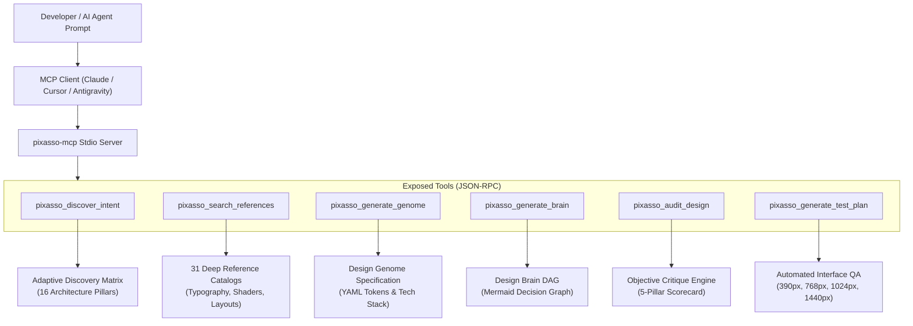
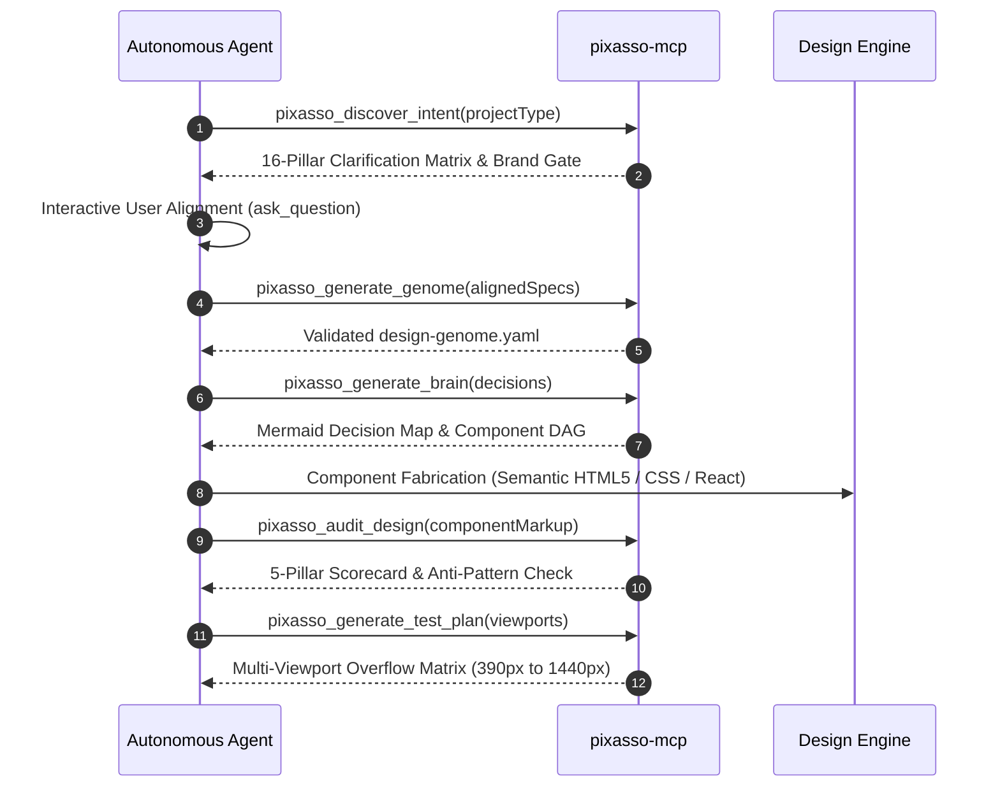

# pixasso-mcp

Model Context Protocol (MCP) server for Pixasso: the complete end-to-end frontend engineering and design orchestrator for AI agents and developers.

[](https://www.npmjs.com/package/pixasso-mcp)
[](https://opensource.org/licenses/MIT)
[](https://nodejs.org/)

Pixasso bridges visionary art direction with robust frontend architecture across 16 foundational engineering pillars. It gives LLMs, coding assistants, and autonomous agents the ability to dynamically discover user intent, validate design tokens, compile Graphify-style architecture decision graphs, critique layouts against AI tropes, search 31 reference catalogs, and generate automated multi-viewport testing matrices.

Live Showcase & Specifications: [https://pixasso.erebuzzz.tech](https://pixasso.erebuzzz.tech) or [https://pixasso-two.vercel.app](https://pixasso-two.vercel.app)

---

## System Architecture



---

## Quick Start

Run instantly without local installation:

```bash
npx -y pixasso-mcp
```

Or install globally:

```bash
npm install -g pixasso-mcp
```

---

## Client Integration

### 1. Claude Desktop
Add to your `claude_desktop_config.json`:

```json
{
  "mcpServers": {
    "pixasso": {
      "command": "npx",
      "args": ["-y", "pixasso-mcp"]
    }
  }
}
```

### 2. Cursor
Add to your Cursor MCP settings (`~/.cursor/mcp.json`):

```json
{
  "mcpServers": {
    "pixasso": {
      "command": "npx",
      "args": ["-y", "pixasso-mcp"]
    }
  }
}
```

### 3. Claude Code CLI
Register in a single command:

```bash
claude mcp add pixasso npx -y pixasso-mcp
```

### 4. Google Antigravity & Gemini CLI
Add to `~/.gemini/antigravity/mcp_config.json`:

```json
{
  "mcpServers": {
    "pixasso": {
      "command": "npx",
      "args": ["-y", "pixasso-mcp"]
    }
  }
}
```

---

## Exposed MCP Tools

| Tool | Purpose | Key Inputs |
| :--- | :--- | :--- |
| `pixasso_discover_intent` | Generates adaptive inquiry matrix across the 16 pillars and brand genesis. | `projectType`, `hasBrandIdentity`, `userGoal` |
| `pixasso_search_references` | Search across 31 curated design & architecture catalogs. | `query`, `category` |
| `pixasso_generate_genome` | Compiles tokens, color ramps, typography, and libraries into `design-genome.yaml`. | `archetype`, `palette`, `typography` |
| `pixasso_generate_brain` | Synthesizes a visual Graphify Mermaid decision graph and Task DAG. | `decisions`, `components` |
| `pixasso_audit_design` | Evaluates markup and styling against AI design anti-patterns. | `codeSnippet`, `context` |
| `pixasso_generate_test_plan` | Produces multi-viewport QA plans (390px, 768px, 1024px, 1440px). | `targetUrls`, `checkSensory` |

---

## Architecture Lifecycle



---

## The 16 Architecture Pillars

Pixasso orchestrates 16 distinct engineering disciplines:

1. **UI and Visual Design**: Ground tone, contrast geometry, and materiality.
2. **Semantic HTML5 & JSX**: Meaningful DOM hierarchies and ARIA roles.
3. **Modern CSS & Tailwind**: Custom properties, container queries, and subgrid layouts.
4. **TypeScript & JS Logic**: Strict typing, immutable schemas, and runtime contracts.
5. **Framework Architecture**: React, Next.js, Svelte, Vue, and Astro paradigms.
6. **State Management**: Zustand, Redux Toolkit, signals, and context boundaries.
7. **API & WebSockets**: Streaming endpoints, SSE telemetry, and real-time state.
8. **Client Auth UX**: Optimistic sessions, token lifecycle, and secure storage.
9. **Forms & Zod Validation**: Type-safe schema validation and real-time feedback.
10. **Motion & 3D WebGL**: Three.js shaders, CSS hardware transforms, and WebGPU.
11. **Responsive Multi-Device Design**: Viewport sweeps at 390px, 768px, 1024px, and 1440px.
12. **WCAG AA/AAA Accessibility**: Keyboard navigation, focus rings, and screen-reader testing.
13. **Core Web Vitals**: INP, LCP, CLS optimizations, and asset tree-shaking.
14. **Testing Architecture**: Vitest, Playwright, and automated overflow checks.
15. **Tooling & DX**: ESLint, Prettier, Vite, and automated CI pipelines.
16. **Edge Deployment**: Immutable releases on GitHub Pages, Vercel, and Cloudflare.

---

## Resources & Prompts

### Resources (`pixasso://`)
- `pixasso://references/{catalogName}`: Direct read access to all 31 reference catalogs including typography systems, motion choreography, sound design, and shader parameters.
- `pixasso://templates/{templateName}`: Access to production blueprints including `design-genome.yaml`, `interface-test-plan.md`, and `code-review.md`.

### Prompts (`mcp://prompts/`)
- `intent-discovery`: Prompt for launching adaptive user interviews without form fatigue.
- `frontend-architecture`: Scaffold complete 16-pillar architecture blueprints.
- `design-critique`: Run rigorous design audits to identify and eliminate AI visual tropes.
- `typography-direction`: Formulate harmonious display, serif, and monospace pairings.
- `interface-qa`: Execute multi-device viewport tests and sensory verification.

---

## License

MIT (c) Erebuzzz
