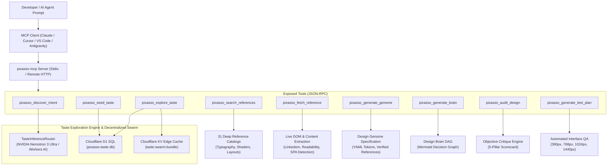
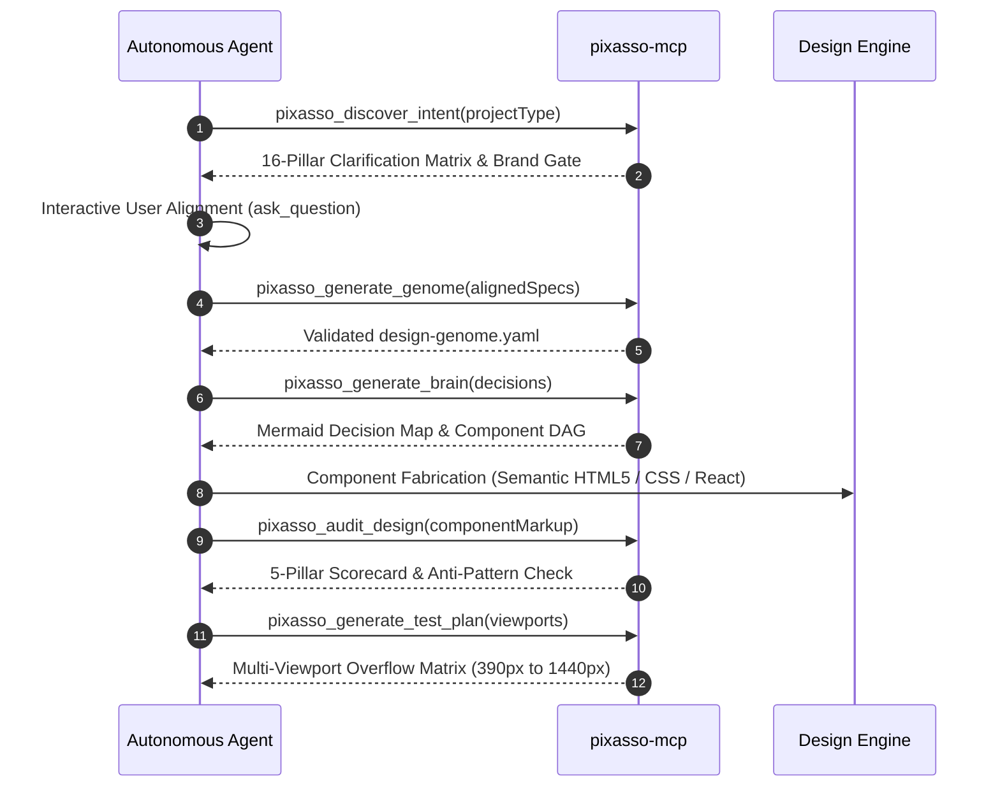
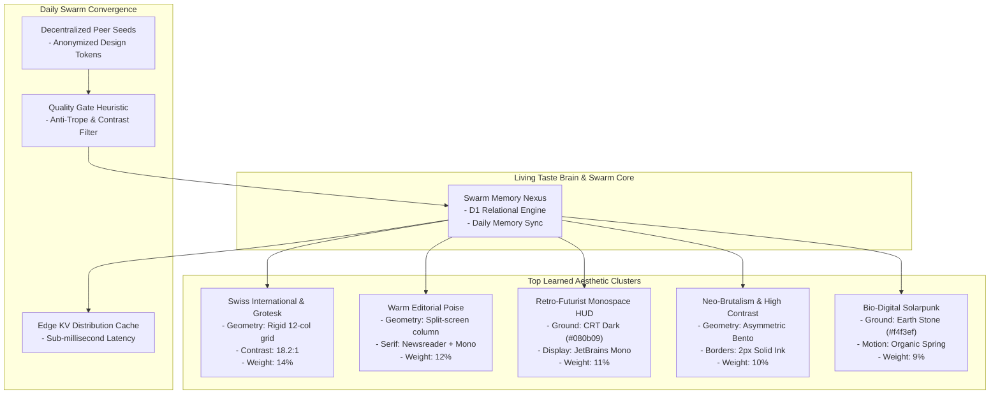

# pixasso-mcp

Model Context Protocol (MCP) server for Pixasso: the complete end-to-end frontend engineering and design orchestrator for AI agents and developers.

[](https://www.npmjs.com/package/pixasso-mcp)
[](https://opensource.org/licenses/MIT)
[](https://nodejs.org/)

Pixasso bridges visionary art direction with robust frontend architecture across 16 foundational engineering pillars. It gives LLMs, coding assistants, and autonomous agents the ability to dynamically discover user intent, validate design tokens, compile Graphify-style architecture decision graphs, critique layouts against AI tropes, search 31 reference catalogs, and generate automated multi-viewport testing matrices.

Live Showcase & Specifications: [https://pixasso.erebuzzz.tech](https://pixasso.erebuzzz.tech) or [https://pixasso-two.vercel.app](https://pixasso-two.vercel.app)

---

## System Architecture


```mermaid
flowchart TD
    User["Developer / AI Agent Prompt"] --> Client["MCP Client (Claude / Cursor / VS Code / Antigravity)"]
    Client --> Server["pixasso-mcp Server (Stdio / Remote HTTP)"]

    subgraph Tools ["Exposed Tools (JSON-RPC)"]
        T1["pixasso_discover_intent"]
        T2["pixasso_search_references"]
        T3["pixasso_fetch_reference"]
        T4["pixasso_generate_genome"]
        T5["pixasso_generate_brain"]
        T6["pixasso_audit_design"]
        T7["pixasso_generate_test_plan"]
        T8["pixasso_explore_taste"]
        T9["pixasso_seed_taste"]
    end

    Server --> Tools

    subgraph TasteBrain ["Taste Exploration Engine & Decentralized Swarm"]
        Router["TasteInferenceRouter<br/>(NVIDIA Nemotron 3 Ultra / Workers AI)"]
        D1["Cloudflare D1 SQL<br/>(pixasso-taste-db)"]
        KV["Cloudflare KV Edge Cache<br/>(taste:swarm:bundle)"]
    end

    T1 --> Router
    T2 --> P2["31 Deep Reference Catalogs<br/>(Typography, Shaders, Layouts)"]
    T3 --> P3["Live DOM & Content Extraction<br/>(Linkedom, Readability, SPA Detection)"]
    T4 --> P4["Design Genome Specification<br/>(YAML Tokens, Verified References)"]
    T5 --> P5["Design Brain DAG<br/>(Mermaid Decision Graph)"]
    T6 --> P6["Objective Critique Engine<br/>(5-Pillar Scorecard)"]
    T7 --> P7["Automated Interface QA<br/>(390px, 768px, 1024px, 1440px)"]
    T8 --> D1
    T8 --> KV
    T9 --> D1
```

---

## Deployment & Connection Transports

Pixasso MCP ships with dual transport architectures side by side:
1. **Local Stdio (npm)**: Runs locally on your machine via stdio with zero network latency.
2. **Hosted Remote (Cloudflare Workers)**: Serverless Streamable HTTP endpoint secured via GitHub OAuth, requiring zero local runtime dependencies.

---

## 1. Hosted Remote Endpoint (Streamable HTTP)

Connect any remote-compatible MCP client directly to:

```text
https://mcp.pixasso.erebuzzz.tech/mcp
```

Connecting will open a GitHub OAuth prompt (`read:user`, `user:email`) to authorize your session. Each authenticated GitHub account receives a daily allowance of 200 tool calls.

---

## 2. Local Stdio Quick Start

Run instantly without local installation:

```bash
npx -y pixasso-mcp
```

Or install globally:

```bash
npm install -g pixasso-mcp
```

---

## Client Integration

### 1. Claude Desktop
Add to your `claude_desktop_config.json`:

```json
{
  "mcpServers": {
    "pixasso-local": {
      "command": "npx",
      "args": ["-y", "pixasso-mcp"]
    },
    "pixasso-remote": {
      "url": "https://mcp.pixasso.erebuzzz.tech/mcp"
    }
  }
}
```

### 2. Cursor
Add to your Cursor MCP settings (`~/.cursor/mcp.json`):

```json
{
  "mcpServers": {
    "pixasso-local": {
      "command": "npx",
      "args": ["-y", "pixasso-mcp"]
    },
    "pixasso-remote": {
      "url": "https://mcp.pixasso.erebuzzz.tech/mcp"
    }
  }
}
```

### 3. VS Code
Add to `.vscode/mcp.json` (for native VS Code MCP and GitHub Copilot) or your extension settings (Cline, Roo Code, Continue):

```json
{
  "mcpServers": {
    "pixasso-local": {
      "command": "npx",
      "args": ["-y", "pixasso-mcp"]
    },
    "pixasso-remote": {
      "url": "https://mcp.pixasso.erebuzzz.tech/mcp"
    }
  }
}
```

### 4. Claude Code CLI
Register local or remote:

```bash
# Local stdio
claude mcp add pixasso npx -y pixasso-mcp

# Remote HTTP
claude mcp add pixasso-remote --transport http https://mcp.pixasso.erebuzzz.tech/mcp
```

### 5. Google Antigravity & Gemini CLI
Add to `~/.gemini/antigravity/mcp_config.json`:

```json
{
  "mcpServers": {
    "pixasso": {
      "command": "npx",
      "args": ["-y", "pixasso-mcp"]
    },
    "pixasso-remote": {
      "url": "https://mcp.pixasso.erebuzzz.tech/mcp"
    }
  }
}
```

### 6. Agent Installation Prompt (Install in Any IDE via AI Assistant)

You can prompt any AI coding assistant in your IDE (Cursor, VS Code, Windsurf, Claude, Copilot, Cline, Roo Code, Antigravity) to configure Pixasso automatically. Simply copy and paste the prompt below into your assistant chat:

```text
Please configure the Pixasso MCP server for my project and editor.

Choose one of the two options:
1. Option A (Hosted Remote, zero local runtime):
   Configure MCP server "pixasso-remote" with URL:
   https://mcp.pixasso.erebuzzz.tech/mcp

2. Option B (Local Stdio):
   Configure MCP server "pixasso" with command "npx" and args ["-y", "pixasso-mcp"]

Add the configuration to the appropriate MCP settings file for this editor (such as .vscode/mcp.json, ~/.cursor/mcp.json, claude_desktop_config.json, or cline_mcp_settings.json) and verify that all 9 Pixasso design and architecture tools are active.
```

---

## Exposed MCP Tools

Every tool conforms to the official Model Context Protocol specification and declares all four directory hints (`readOnlyHint`, `destructiveHint`, `idempotentHint`, `openWorldHint`):

| Tool | Purpose | Key Inputs | Hints |
| :--- | :--- | :--- | :--- |
| `pixasso_discover_intent` | Adaptive inquiry synthesizer across 16 pillars and brand genesis, powered by the Taste Inference Engine. Synthesizes 3 bespoke aesthetic worlds with compulsory popup questions. | `projectArchetype`, `description`, `targetAudience`, `hasBrandIdentity`, `referenceUrls` | readOnly, idempotent |
| `pixasso_search_references` | Search across 31 curated design & architecture catalogs. | `query`, `category`, `tag` | readOnly, idempotent |
| `pixasso_fetch_reference` | Fetches live HTML, extracts title/headings/readable text, detects client SPAs, and caches verified fetches. | `url`, `focus` | readOnly, openWorld |
| `pixasso_generate_genome` | Compiles tokens, color ramps, typography, and libraries into `design-genome.yaml`. Enforces programmatic hard gate on verified references. | `projectName`, `themeMode`, `groundTone`, `typography`, `colorTokens`, `references` | readOnly, idempotent |
| `pixasso_generate_brain` | Synthesizes a visual Graphify Mermaid decision graph and Task DAG. | `projectName`, `decisions`, `tasks` | readOnly, idempotent |
| `pixasso_audit_design` | Evaluates markup and styling against AI design anti-patterns. | `componentMarkup`, `contextDescription` | readOnly, idempotent |
| `pixasso_generate_test_plan` | Produces multi-viewport QA plans (390px, 768px, 1024px, 1440px). | `projectName`, `testUrl`, `testedViewports` | readOnly, idempotent |
| `pixasso_explore_taste` | Explores the living Design Taste Graph across 12 movements and community-seeded directions without generic AI tropes. | `query`, `movement`, `archetype`, `includeSwarm`, `limit` | readOnly, idempotent |
| `pixasso_seed_taste` | Anonymously seeds sanitized high-craft design tokens to the decentralized Taste Swarm with strict opt-in consent. | `archetype`, `movement`, `typographyTokens`, `paletteTokens`, `layoutTokens`, `motionTokens`, `uisfxTokens`, `consentGiven` | openWorld, idempotent |


### Tool Scope & Design Integrity Hard Gates

- **`pixasso_discover_intent` (Taste Inference & Adaptive Question Picker)**: Formulates 3 bespoke aesthetic worlds tailored directly to your project brief using free multi-provider LLM routing (NVIDIA Nemotron 3 Ultra, OpenRouter free models, Workers AI, or 12 foundational movements). The returned `compulsoryPopupQuestions` include brand gates, domain decisions, and the decentralized taste swarm consent choice for presentation via `ask_question`.
- **`pixasso_explore_taste` (Living Taste Graph)**: Queries curated movements and community seeds. Returns typography pairings, WCAG-evaluated palettes, layout geometries, and micro-interaction audio cues.
- **`pixasso_seed_taste` (Consent-Gated Swarm Seeding)**: Allows client nodes to anonymously seed sanitized design tokens back to Cloudflare D1. Zero code or private text is ever transmitted.
- **`pixasso_fetch_reference` (Real Content Deconstruction)**: Autonomous models often hallucinate visual traits from domain names alone. `pixasso_fetch_reference` inspects live pages, extracting DOM headings, metadata, visible links, and readable text via Mozilla Readability. If the page is an empty client SPA shell (under 200 characters of text), it flags `renderedContentDetected: false` so agents do not fabricate visual descriptions.
- **Reference Gate on `pixasso_generate_genome`**: Any reference URL supplied to `pixasso_generate_genome` must first be verified through `pixasso_fetch_reference` in the active session. If an unfetched URL is passed, the tool rejects the call with an informative error. Furthermore, unrendered SPA shells cannot claim `epistemicStatus: 'known'` without screenshot verification.

---

## Architecture Lifecycle


```mermaid
sequenceDiagram
    autonumber
    participant Agent as Autonomous Agent
    participant MCP as pixasso-mcp
    participant Engine as Design Engine

    Agent->>MCP: pixasso_discover_intent(projectType)
    MCP-->>Agent: 16-Pillar Clarification Matrix & Brand Gate
    Agent->>Agent: Interactive User Alignment (ask_question)
    Agent->>MCP: pixasso_generate_genome(alignedSpecs)
    MCP-->>Agent: Validated design-genome.yaml
    Agent->>MCP: pixasso_generate_brain(decisions)
    MCP-->>Agent: Mermaid Decision Map & Component DAG
    Agent->>Engine: Component Fabrication (Semantic HTML5 / CSS / React)
    Agent->>MCP: pixasso_audit_design(componentMarkup)
    MCP-->>Agent: 5-Pillar Scorecard & Anti-Pattern Check
    Agent->>MCP: pixasso_generate_test_plan(viewports)
    MCP-->>Agent: Multi-Viewport Overflow Matrix (390px to 1440px)
```

---

## The 16 Architecture Pillars

Pixasso orchestrates 16 distinct engineering disciplines:

1. **UI and Visual Design**: Ground tone, contrast geometry, and materiality.
2. **Semantic HTML5 & JSX**: Meaningful DOM hierarchies and ARIA roles.
3. **Modern CSS & Tailwind**: Custom properties, container queries, and subgrid layouts.
4. **TypeScript & JS Logic**: Strict typing, immutable schemas, and runtime contracts.
5. **Framework Architecture**: React, Next.js, Svelte, Vue, and Astro paradigms.
6. **State Management**: Zustand, Redux Toolkit, signals, and context boundaries.
7. **API & WebSockets**: Streaming endpoints, SSE telemetry, and real-time state.
8. **Client Auth UX**: Optimistic sessions, token lifecycle, and secure storage.
9. **Forms & Zod Validation**: Type-safe schema validation and real-time feedback.
10. **Motion & 3D WebGL**: Three.js shaders, CSS hardware transforms, and WebGPU.
11. **Responsive Multi-Device Design**: Viewport sweeps at 390px, 768px, 1024px, and 1440px.
12. **WCAG AA/AAA Accessibility**: Keyboard navigation, focus rings, and screen-reader testing.
13. **Core Web Vitals**: INP, LCP, CLS optimizations, and asset tree-shaking.
14. **Testing Architecture**: Vitest, Playwright, and automated overflow checks.
15. **Tooling & DX**: ESLint, Prettier, Vite, and automated CI pipelines.
16. **Edge Deployment**: Immutable releases on GitHub Pages, Vercel, and Cloudflare.

---

## Living Taste Brain & Swarm Memory (Daily Edge Sync)

Pixasso MCP features an autonomous exploration layer and decentralized "Taste Swarm" inspired by BitTorrent seeding. Rather than asking repetitive questions or defaulting to generic AI tropes, Pixasso continuously explores design movements, synthesizes bespoke aesthetic worlds, and learns high-craft token combinations from consented peer nodes at zero financial cost.

### Living Swarm Memory Status
- **Storage**: Cloudflare D1 Serverless SQL (`pixasso-taste-db`)
- **Edge Cache**: Global Cloudflare KV (`taste:swarm:bundle`)
- **Daily Memory Consolidation**: Runs at 00:00 UTC via Cloudflare Workers Cron and GitHub Actions
- **Live Memory Endpoint**: `https://mcp.pixasso.erebuzzz.tech/taste/brain`


```mermaid
graph TD
    subgraph SwarmMemoryCore ["Living Taste Brain & Swarm Core"]
        Core["Swarm Memory Nexus<br/>- D1 Relational Engine<br/>- Daily Memory Sync"]
    end

    subgraph ActiveClusters ["Top Learned Aesthetic Clusters"]
        C1["Swiss International & Grotesk<br/>- Geometry: Rigid 12-col grid<br/>- Contrast: 18.2:1<br/>- Weight: 14%"]
        C2["Warm Editorial Poise<br/>- Geometry: Split-screen column<br/>- Serif: Newsreader + Mono<br/>- Weight: 12%"]
        C3["Retro-Futurist Monospace HUD<br/>- Ground: CRT Dark (#080b09)<br/>- Display: JetBrains Mono<br/>- Weight: 11%"]
        C4["Neo-Brutalism & High Contrast<br/>- Geometry: Asymmetric Bento<br/>- Borders: 2px Solid Ink<br/>- Weight: 10%"]
        C5["Bio-Digital Solarpunk<br/>- Ground: Earth Stone (#f4f3ef)<br/>- Motion: Organic Spring<br/>- Weight: 9%"]
    end

    subgraph LearningPipeline ["Daily Swarm Convergence"]
        T1["Decentralized Peer Seeds<br/>- Anonymized Design Tokens"] --> AntiTrope["Quality Gate Heuristic<br/>- Anti-Trope & Contrast Filter"]
        AntiTrope --> Core
        Core --> C1
        Core --> C2
        Core --> C3
        Core --> C4
        Core --> C5
        Core --> EdgeKV["Edge KV Distribution Cache<br/>- Sub-millisecond Latency"]
    end
```

---

## Zero-Cost Inference Router: Are API Keys Required?

**No. You do NOT need any API keys to use Pixasso MCP.**

Pixasso MCP is built with a tiered fallback architecture designed to remain completely free for developers and agents out of the box:

| Tier | Provider / Engine | API Key Requirement | Purpose & Fallback Behavior |
| :--- | :--- | :--- | :--- |
| **Tier 1** | **NVIDIA NIM** (`nvidia/nemotron-3-ultra-550b`) | Optional (Server Secret) | Advanced artistic direction and unconventional palette generation. NVIDIA offers 1,000 free trial credits at build.nvidia.com. If unset, instantly skips to Tier 2. |
| **Tier 2** | **OpenRouter Free Tier** (`llama-3.3-70b-instruct:free`, `gemini-2.0-flash-exp:free`) | Optional (Server Secret) | Free multi-model inference. Requires only a free OpenRouter account with $0 balance. If unset, instantly skips to Tier 3. |
| **Tier 3** | **Cloudflare Workers AI** (`@cf/meta/llama-3.3-70b-instruct`) | None (Built-in) | Runs directly on the Cloudflare edge via the Worker `AI` binding. Cloudflare provides 10,000 free neurons daily with zero external keys required. |
| **Tier 4** | **Foundational Design Graph** (12 Curated Movements) | None (100% Offline) | Deterministic design pairing across 12 high-taste movements. Operates with zero network calls, zero latency, and zero token costs. |

### For Local Stdio Users (`npx -y pixasso-mcp`)
You do not need to provide any API keys or configuration files. The local stdio server will run the offline foundational graph and local rules with zero cloud dependency.

### For Self-Hosters Deploying Their Own Remote Worker
If you deploy your own instance of the Cloudflare Worker and wish to connect NVIDIA NIM or OpenRouter, you can optionally store secrets using Wrangler:

```bash
# Optional: Set NVIDIA NIM API key
npx wrangler secret put NVIDIA_API_KEY

# Optional: Set OpenRouter API key
npx wrangler secret put OPENROUTER_API_KEY
```
If you omit these secrets, your worker will seamlessly use Cloudflare Workers AI and the offline foundational graph with zero errors.

---

## Resources & Prompts

### Resources (`pixasso://`)
- `pixasso://references/{catalogName}`: Direct read access to all 31 reference catalogs including typography systems, motion choreography, sound design, and shader parameters.
- `pixasso://templates/{templateName}`: Access to production blueprints including `design-genome.yaml`, `interface-test-plan.md`, and `code-review.md`.

### Prompts (`mcp://prompts/`)
- `intent-discovery`: Prompt for launching adaptive user interviews without form fatigue.
- `frontend-architecture`: Scaffold complete 16-pillar architecture blueprints.
- `design-critique`: Run rigorous design audits to identify and eliminate AI visual tropes.
- `typography-direction`: Formulate harmonious display, serif, and monospace pairings.
- `interface-qa`: Execute multi-device viewport tests and sensory verification.

---

## License & Privacy

- **License**: MIT (c) Erebuzzz. See [LICENSE](../LICENSE).
- **Privacy Policy**: Zero telemetry, zero prompt recording, ephemeral in-memory processing. See [PRIVACY.md](PRIVACY.md).

